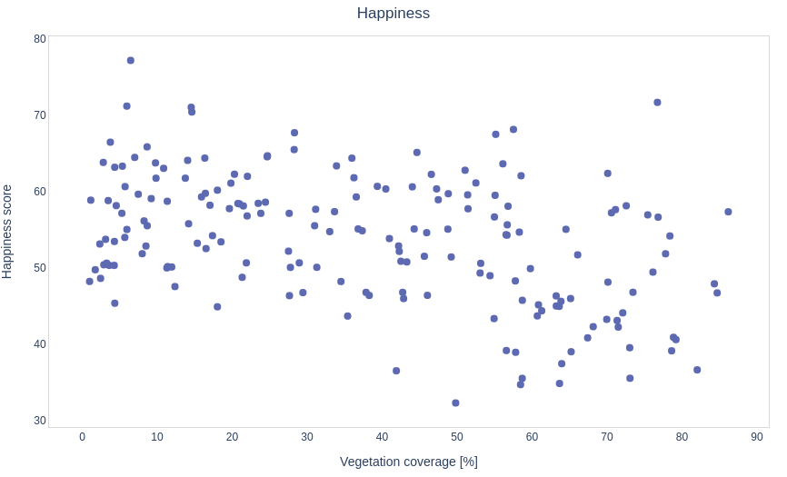

# SaTreeLight

----------

### Presentasjon - Gruppe 3

Thomas, Gaute, Sofie, Victor, Trym

<section>
  <aside class="notes">
    - Vi er gruppe 3 og vi er her for å presentere en applikasjon vi har laget; SaTreeLight!
     
    - Men først skal vi skal vi snakke litt om hvordan vi kom frem til appen.  
    </aside>
</section>

---

## Første oppgave - Varmetap fra hus

    

        - Mål: Måle varmetap fra hus med IR bilder fra satellitt
         
        - Komplikasjon: For lav oppøsning (100m per pixel)
        - Byttet oppgave på landsbydag 5
    

<section>
  <aside class="notes">
        - Vår første oppgave var å måle varmetap fra bygg ved hjelp av satellittbilder
         
        - Vi slet med å finne bilder i riktig bånd med god oppløsning
         
        - Sentinel har kun SWIR (Short-Wave InfraRed) som brukes for fuktighet og temperatur > 100°C
         
        - Landsat har thermal, men med en oppløsning på 100m per pixel, ikke godt nok
         
        - På landsbydag 5 byttet vi til en annen oppgave.
    </aside>
</section>

---

## Andre oppgave - Vegetasjon og lykke

    

    - Finne polygoner av byer
     
    - Hente ut NDVI fra Sentinel-2 
    - Regne ut hvor stor andel som er vegetasjon
    - Se om det er sammenheng med lykke
    

    

<section>
    <aside class="notes">
        - Vi endret oppgave til å se på sammenhengen mellom vegetasjon og lykke i byer
         
        - Vi brukte NDVI fra Sentinel 2
         
        - Laget et program i python for å automatisk regne ut prosentandel vegetasjon i byer
         
        - Bruker geoJson polygoner fra OpenStreetMap til å klippe ut byene fra SentinelHub sine data.
         
        - Fjerner alle pixler som ikke kan defineres som vegetasjon og regner antall pixler med vegetasjon vs ikke
    </aside>
</section>

---

[#]: Plots

<section>
    <aside class="notes">
        Sammenhengen var absolutt ikke signifikant, så vi ønsket derfor å se om det kunne være noen tydeligere sammenheng hvis man så nærmere på de tre underkategoriene som happiness-indexen er basert på.
    </aside>
</section>

--

--

--

---

## Tredje oppgave - Lage applikasjon

-   Bruke Flutter til å lage en app som kan vise den innsamlede dataen

-   Bruksområde:
    -   Skjelett for å vise frem statistikk om byer
    -   Kan utvides til flere byer og til å vise mer data
    -   Interessant for byplanlegging
    -   Kan potensielt spillifiseres

<section>
    <aside class="notes">
        På grunn av den lite signifikante dataen var vi nødt til å dra oppgaven i en ny retning - igjen. Vi vurderte om vi skulle sammenligne opp mot annen type data enn lykke, men følte at det ikke var en stor nok oppgave, samtidig som at det ikke hadde gitt oss noe større læringsutbytte. Vi bestemte oss derfor for å utvikle en applikasjon med Flutter, siden dette var noe to på gruppa hadde erfaring med fra før, og resten av gruppa var interessert i å lære.
         
        Applikasjonen viser en oversikt over alle byene vi samlet inn data om, så kan man klikke seg inn på hver by for å finne ut mer om den spesifikke byen. 
         
        Bruksområde for applikasjonen er først og fremst et skjelett for å kunne vise fram vilkårlig statistikk om byer, og den er laget slik at det skal være enkelt å legge til mer statistikk og flere byer. Dette kan være relevant hvis man for eksempel ønsker å finne en by å bosette seg i. Da kunne man utvidet applikasjonen til å vise blant annet boligpriser for ulike områder, oversikt over skoler ol. Et annet bruksområde kunne vært byplanlegging, og å videre kunne visualisere hva som gjør innbyggerne i en by lykkelige. Man kunne også spillifisert applikasjonen til et trivia-spill om bystatistikk. 
    </aside>
</section>

---

[#]: Application

<section data-background-iframe="https://satreelight.github.io/"
          data-background-interactive>
</section>

---

## Spørsmål?
